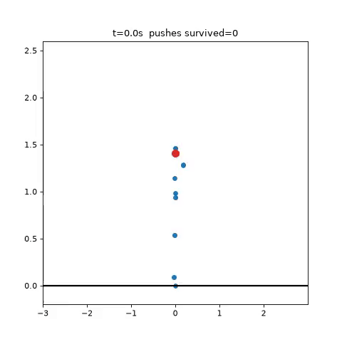

# FightLab

Self-play boxing reinforcement learning for humanoid robots.

Two humanoids in a MuJoCo arena. Each controls joint torques for shoulders, elbows, hips, knees, and neck. Damage comes from fist-to-body contact force. The goal: learn to fight, then transfer to real hardware.



## Why

Robot combat is entertainment on the outside and a contact-robustness benchmark on the inside. A policy that can throw punches, absorb hits, and stay upright under domain randomization is the same policy that survives real-world actuator noise, friction variation, and impacts. Sim2Real transfer is the prize.

## Environments

| Env | File | Milestone |
|---|---|---|
| `BalanceEnv` | `envs.py` | Stay upright while shoved at random times, directions, and magnitudes (100–400 N torso impulses). The primitive everything else is built on. |
| `PunchEnv` | `punch_env.py` | Balance + a 20 kg heavy-bag target at jab range. Reward = standing + damage dealt. Domain randomization baked in: ±10% torso mass, ±15% floor friction, ±10% actuator gear per episode. |
| `BoxingEnv` | `boxing_env.py` | Full two-agent self-play boxing. HP-based damage from fist contact force, knockdown termination, damage cooldown to prevent hit-spam. |

## Rules (boxing v1)

Only score what matters.

- **Win by KO:** opponent's torso stays down
- **Otherwise:** higher HP when the round timer ends
- **Damage:** scales with fist contact force, capped per hit, halved for weak contact
- **Anti-spam:** damage cooldown between scoring hits
- **Actions:** raw joint torques, clipped to ±50 N·m
- **Observations:** own joint state, opponent pose, contact forces, both HP values

## Trained checkpoints

`models/` contains PPO checkpoints from the balance milestone:

- `balance_ppo2.zip` — current balance policy
- `smoke.zip` — early smoke-test run

## Usage

```bash
pip install mujoco gymnasium stable-baselines3 imageio matplotlib

# Train the balance baseline (16 parallel envs)
python train_balance.py --timesteps 1000000 --out models/balance_ppo

# Evaluate a policy: push survival stats
python eval_balance.py --model models/balance_ppo2.zip --episodes 20

# Hard mode: more frequent, harder pushes
python eval_balance.py --model models/balance_ppo2.zip --hard

# Render a replay video (software-rendered stick figure, no GL needed)
python eval_balance.py --model models/balance_ppo2.zip --video replay.mp4
```

## Roadmap

- **Phase 1 — Sim (now):** balance → punching → self-play boxing with ELO-rated kings. Domain randomization and actuator limits in the env from day one.
- **Phase 2 — One real robot:** deploy the king's balance policy on a single Unitree G1.
- **Phase 3 — Real bout:** two-robot autonomous boxing match.

## Repo layout

```
boxing_env.py      Two-agent boxing arena (MuJoCo XML + env logic)
envs.py            BalanceEnv: humanoid + randomized torso pushes
punch_env.py       PunchEnv: BalanceEnv + strike target + domain randomization
train_balance.py   PPO training entry point
eval_balance.py    Evaluation + replay rendering
models/            Trained PPO checkpoints
```
